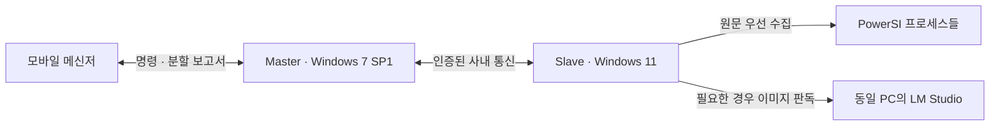

# Messenger Remote Control v0.3.0

모바일 KI-Messenger의 나와의 대화에 명령을 보내면 Desktop의 **Master**가 Workstation의 **Slave**에 상태를 요청하고, PowerSI별 결과를 같은 대화로 회신합니다.



## 설치와 실행

[공개 Releases](https://github.com/yunhyok/Messenger-Remote-Control/releases)에서 역할에 맞는 설치 파일을 받으세요. 오프라인 Slave에는 Slave 설치 파일 또는 Slave ZIP만 옮기면 됩니다. 자세한 설치·업그레이드 방법은 [INSTALL.md](INSTALL.md)에 있습니다.

v0.3.0은 PowerSI의 **수집된 전체 Output**을 전송합니다. 이전 5줄·600자 발췌 제한은 없습니다. Master와 Slave를 모두 v0.3.0으로 업그레이드해야 하며, 연결파일과 설정은 그대로 유지됩니다. Ready 뒤의 첫 명령만 처리하고 처리 중 추가 메시지는 다음 Ready까지 무시합니다.

1. Workstation에서 Slave를 실행하고 통신 IP를 선택한 뒤 Start를 누릅니다. 화면 판독이 필요한 경우 같은 PC의 LM Studio 서버와 이미지 모델을 사용자가 미리 준비합니다.
2. Slave의 연결파일을 내보내 Desktop Master로 전달합니다. 이 파일은 공개하거나 저장소에 넣지 마세요.
3. Master에서 연결파일을 열고, KI-Messenger의 나와의 대화를 독립 창으로 연 뒤 연결합니다.
4. 메신저에서 `Master Ready`를 확인한 뒤 모바일에서 `pwrsi`를 보냅니다. 처리 시작 안내가 한 번 도착하며, 이후 추가 메시지는 대기열에 넣지 않고 무시합니다. 같은 보고서 번호의 마지막 `N/N`과 다음 `Master Ready`를 받은 뒤 새 명령을 보내세요. Ready 뒤의 대괄호 번호는 각 접수 회차를 구분하며 명령에 입력하지 않습니다.

## 명령

| 전체 메시지 본문 | 동작 |
|---|---|
| `help` | 허용 명령과 사용법 |
| `help help`, `help total status`, `help pwrsi` | 해당 명령 도움말 |
| `total status` | Slave 기본 상태와 프로세스 목록 |
| `pwrsi` | 모든 PowerSI 인스턴스를 한 번 수집해 보고 |

명령은 새 메시지의 본문 전체가 일치해야 합니다. 답장에 포함된 명령 같은 문구는 실행하지 않습니다. 예약 감시, PowerSI 실행·종료와 임의 원격 명령은 제공하지 않습니다.

## 보고서 읽기

- 응답하지 않는 대상은 **전체 Process Name (PID): Pending**만 표시합니다. 해당 대상의 수치·Output은 보내지 않습니다. 이는 Windows 응답 검사 결과이며 PowerSI 내부 계산 대기를 모두 판별하는 기능은 아닙니다.
- 이름은 보고서의 첫 등장에 전체로 표시합니다. 32자를 넘는 이름이 다시 나오면 앞 16자와 뒤 8자를 남깁니다. 다음 조회에서는 다시 전체 이름을 표시합니다.
- 원문 직접 읽기·자동 복사를 우선하고, 유효한 보조 OCR도 메타데이터와 함께 사용합니다. Slave는 수집한 전체 본문을 해석하거나 요약하지 않습니다. 첫 조회는 각 대상의 수집된 전체 Output을 보내고, 같은 Slave 인증서·세션·PID·시작 시각·수집 출처의 다음 조회는 새로 추가된 부분만 보냅니다.
- 이전 본문이 그대로이면 **추가 Output 없음**이라고 명시합니다. 이것은 실제 계산이 멈췄다는 증거가 아닙니다. 로그가 비워지거나 기존 접두부가 바뀌면 현재 전체 본문을 변경·초기화 안내와 함께 다시 보냅니다. OCR의 스크롤 뷰포트는 접두부가 바뀌면 보수적으로 현재 전체 뷰포트를 다시 보냅니다.
- 한 번의 텍스트 수집에는 기존 8 Mi 문자 한도가 있으며, 초과하면 자르지 않고 명시적 실패로 알립니다. 화면·스크린샷·거부된 원시 모델 응답은 Slave에 남습니다.
- 각 회신은 1,400자 이내이며 같은 보고서 번호와 순번을 갖습니다. 프로세스 존재, CPU, 실행 시간은 완료나 진행률의 근거로 사용하지 않습니다.
- 수집에는 전체 100초를 배정하고 남은 대상에 시간을 나눕니다. 최대 128개 대상과 목록 밖 누락 수, 미확인·시간 초과를 표시합니다. 조회·답장 준비 한도는 120초이고 실제 분할 전송 시간은 별도입니다.

Master는 `%LOCALAPPDATA%\RemoteMonitorMaster\state\powersi-output-history-v1.txt`에 본문이 아닌 길이와 SHA256만 보관합니다. 모든 준비된 분할 메시지가 메신저의 전송 동작과 입력창 비워짐을 확인한 뒤에만 이 기록을 갱신합니다. 모바일 수신 자체를 인증하는 기능은 아닙니다. 중간 전송이 끊기면 다음 새 조회에서 앞부분이 반복될 수 있지만, 아직 보내지 못한 부분을 빼지는 않습니다. 자동 재시도는 하지 않습니다.

LM Studio 설정 꺼짐, 서버 미실행, 모델 미로드·오류, 잠금, 최소화, 대상 종료, 사용자 입력 간섭을 가능한 정보와 함께 안내합니다. 서버나 모델을 자동으로 시작하지 않습니다. Master/메신저 자체가 꺼져 있거나 안전한 대화 확인이 실패하면 모바일 회신을 보장할 수 없습니다. 전송 성공 여부가 불명확하면 남은 부분을 중단하고 재전송하지 않습니다.

하나의 보고서 원문 합계와 준비된 답장은 각각 32 Mi 문자 이내로 처리합니다. 이를 넘으면 명시적인 크기 오류를 보내며, 일부만 잘라 정상 보고로 보내거나 이력을 갱신하지 않습니다. 긴 분할 전송도 대화창 확인이 유지되는 동안에만 진행합니다.

## 개발과 확인

```powershell
powershell -ExecutionPolicy Bypass -File scripts/build-package.ps1
powershell -ExecutionPolicy Bypass -File scripts/build-installers.ps1
```

[HANDOFF.md](HANDOFF.md)는 현재 검증 상태, [SLAVE-TEST.md](SLAVE-TEST.md)와 [WIN7-TEST.md](WIN7-TEST.md)는 새 모바일 보고 경로의 짧은 현장 확인 안내입니다.

출발 소스: [Remote-Control-App v0.1.58](https://github.com/yunhyok/Remote-Control-App/tree/1365e2c249d00b2a73634c77cd7bc82247f82405). 이 저장소는 해당 커밋의 공개 가능한 소스와 빌드 파일을 독립적으로 복사했습니다. 기존 저장소 및 HFSS 작업은 변경하지 않습니다.
