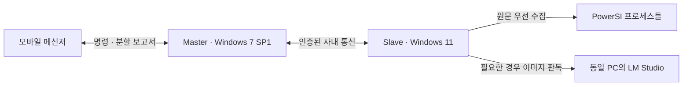

# Messenger Remote Control v0.3.11

모바일 KI-Messenger의 나와의 대화에 명령을 보내면 Desktop의 **Master**가 Workstation의 **Slave**에 상태를 요청하고, PowerSI별 결과를 같은 대화로 회신합니다.


```mermaid
flowchart LR
  Phone[모바일 메신저] <-->|명령 · 분할 보고서| Master[Master · Windows 7 SP1]
  Master <-->|인증된 사내 통신| Slave[Slave · Windows 11]
  Slave -->|원문 우선 수집| PowerSI[PowerSI 프로세스들]
  Slave -->|필요한 경우 이미지 판독| LLM[동일 PC의 LM Studio]
```

## 설치와 실행

[공개 Releases](https://github.com/yunhyok/Messenger-Remote-Control/releases)에서 역할에 맞는 설치 파일을 받으세요. 오프라인 Slave에는 Slave 설치 파일 또는 Slave ZIP만 옮기면 됩니다. 자세한 설치·업그레이드 방법은 [INSTALL.md](INSTALL.md)에 있습니다.

v0.3.11은 2026-10-04 현장 로그(Master·Slave 0.3.10)에서 확인된 문제에 대한 변경입니다. 그 로그에서 `pwrsi` 첫 조회는 한 대상의 Output 약 4.8만 자를 그대로 실어 40개 메시지를 준비했고, 12개를 보낸 뒤 메신저가 대화 기록 맨 위 행을 정리하자 Master가 접수한 명령 행을 다시 찾지 못해 회신과 운용이 멈췄습니다. 바뀐 점은 다음과 같습니다. ① `pwrsi` 답장은 대상마다 Output(처음은 전체, 이후는 추가분)이 3,000자를 넘으면 끝 3,000자만 보내고, 그 앞에 `…(앞 N자 생략, 전체 M자)`로 생략한 글자 수를 알립니다. 전송 이력은 전체 본문 기준으로 저장되므로 생략된 앞부분은 나중에도 보내지 않고, 다음 조회는 그 뒤에 추가된 부분만 봅니다. 버퍼·자동 복사로 읽은 대상에는 `완료 판정: 완료 / 진행 중 / 완료 대기 / 표지 없음` 줄이 붙습니다(watchdog과 같은 규칙, 표시 전용이며 OCR은 판정하지 않음). ② 긴 회신 도중 메신저가 위쪽 행을 한 번에 8개 이하로 정리하면 Master가 Ready와 접수한 명령을 본문으로 다시 찾아 회신을 이어 갑니다. 그래도 명령 행을 확인하지 못했는데 앞부분은 정상 전송됐고 다음 부분은 입력 전이었다면, 세션을 끝내지 않고 `전송 중 수신 확인에 실패해 보고를 중단했습니다 (c/p). 새 Ready 이후의 명령만 처리합니다.`를 한 번 보낸 뒤 새 `Master Ready`를 보냅니다. 남은 부분은 다시 보내지 않으며 전송 이력도 갱신하지 않으므로, 새 Ready 뒤에 다시 보낸 `pwrsi`가 보내지 못한 Output을 포함합니다. ③ Slave는 PowerSI와 같은 실행 파일을 쓰는 PowerDC 모드 창을 수집에서 제외합니다(읽기·화면 캡처·LLM·입력·클립보드 사용 없음). 답장에는 `PowerDC 모드 창: Output 수집 대상이 아닙니다 (읽기·입력·복사 없음)` 한 줄만 나오고, watchdog도 이런 창을 알림 없이 감시에서 뺍니다. 창 종류를 판단할 수 없으면 종전대로 수집합니다. ④ Slave의 "PowerSI 화면의 로컬 LLM 판독 사용"이 꺼져 있어도 "모든 PowerSI Output 자동 탐색·복사"(기본 켜짐)가 켜져 있고 겨눌 위치(그 PowerSI에서 저장한 위치나 Output 창 영역)가 있으면 대체 복사를 시도합니다. 이때도 PowerSI 창을 앞으로 가져오고 클립보드를 덮어쓰므로, 원하지 않으면 자동 탐색·복사를 끄세요. Output 창이 별도 창 핸들 없이 그려지는 경우 그 영역을 접근성 정보로 찾아 대체 복사에 쓰고, 65,535자를 넘는 Unicode RichEdit Output도 두 번 같은 결과로 읽히면 직접 읽습니다. **실제 현장에서는 아직 확인하지 않았습니다**(자동 검사만 통과).

v0.3.10은 Slave의 로컬 LLM(LM Studio)이 PowerSI Output 위치를 찾지 못할 때를 위한 Slave 변경입니다. 지금까지는 서버 꺼짐·모델 미로드·시간 초과·판독 불가로 위치 확인이 실패하면 그 대상의 Output을 받지 못했습니다(`AUTO_COPY_REGION_UNCONFIRMED`). 이제 Slave의 LLM 판독과 자동 탐색·복사가 켜져 있으면 LLM 없이 위치를 정해 기존 자동 복사(Ctrl+A/Ctrl+C, 같은 창·크기·본문 위치·가림·입력·클립보드 확인 그대로)를 시도합니다. 순서는 ① 같은 PowerSI 프로세스에서 이전에 LLM이 확인해 복사했던 위치(이전 본문과 이어지는지 확인), ② PowerSI 창이 알려 주는 Output 창 영역, ③ 같은 창 크기의 다른 PowerSI에서 확인했던 위치입니다. 성공하면 `pwrsi` 답장의 출처가 "자동 복사(LLM 위치 확인 실패 → …)"로 표시되고 LLM 실패 코드가 함께 나오며, 모두 실패하면 그 결과와 다음 행동을 한 줄로 안내합니다. 위치는 Slave의 `%LOCALAPPDATA%\RemoteMonitorSlave\output-anchors-v1.txt`에 좌표·창 크기·식별값만 저장되고 Output 본문은 저장되지 않습니다. 대체 복사도 종전 자동 복사처럼 PowerSI 창을 앞으로 가져오고 클립보드를 덮어쓰며 복원하지 않습니다. 이렇게 읽은 본문은 watchdog 완료 판정에도 쓰입니다. Master와 Slave 실행 파일·설치파일에는 새 아이콘(Master: 메신저 말풍선과 원격 신호, Slave: 작업용 화면과 주파수 스윕·완료 체크)이 들어갔습니다. **실제 현장에서는 아직 확인하지 않았습니다**(자동 검사만 통과).

v0.3.9는 휴대폰 명령 `watchdog`을 추가한 Master 변경입니다. `watchdog on`을 보내면 그 시점에 Slave에서 실행 중인 PowerSI를 감시 목록에 올리고, Master 시작 화면에서 고른 주기(30분 또는 60분)마다 `pwrsi`와 같은 방법으로 Output을 수집해 버퍼·자동 복사로 읽은 Output에 `AFS Finished`와 `Total Sampling Points`가 보이면 `WATCHDOG … | 완료 알림`을 보내고 해당 감시를 해제합니다. 알림 뒤에는 새 `Master Ready`가 옵니다. Pending·수집 실패·OCR 결과는 완료로 판정하지 않고, 이 확인은 `pwrsi`의 전송 이력을 바꾸지 않습니다. 감시는 Master의 운용 세션이 끝나면(Stop·잠금·절전) 함께 끝납니다. 직접 버퍼 읽기가 실패한 대상은 `pwrsi`와 같이 Slave에서 PowerSI 창 활성화와 자동 복사(포커스·클립보드 사용)를 쓸 수 있고 Slave에는 사용자가 작업 중인지 보는 보호가 없으므로, Slave PC를 직접 쓰는 동안에는 감시를 꺼 두는 편이 안전합니다. **실제 현장에서는 아직 확인하지 않았습니다**(자동 검사만 통과). Slave는 버전 표기만 0.3.9로 올랐습니다.

v0.3.8은 0.3.6 Master를 밤새 켜 둔 현장 로그에서 확인된 중단을 고친 Master 변경입니다. 대화 기록이 길어져 대화창을 한 번 읽는 데 8초 가까이 걸리자, 회신 직전에 쓰는 화면 증거의 유효기간(15초)이 그 읽기 두 번(15.5~16.0초)보다 짧아졌고, 명령을 정확히 인식하고도 회신 직전에 중단되며 세션이 끝났습니다. 창을 옮기거나 무엇을 입력한 일은 없었습니다. v0.3.8은 이 유효기간을 한 번 읽기의 상한(15초)의 두 배에 5초를 더한 35초로 맞춥니다. 또한 실제 입력이 시작되기 전에 중단된 요청은 세션을 끝내는 대신 새 `Master Ready`를 보내 다시 대기합니다(연속 3회까지, 그 뒤에는 세션 종료). 입력이 시작된 뒤의 중단은 종전처럼 세션을 끝내며, 중단된 답장을 자동으로 다시 보내는 일은 어느 경우에도 없습니다. 재개되면 회신 없이 새 `Master Ready`만 도착하므로 명령을 다시 보내세요. 접수·전송·이력 규칙과 프로토콜 0.3.0은 그대로입니다. **실제 야간 운용에서는 아직 확인하지 않았습니다**(자동 검사만 통과). Slave는 버전 표기만 0.3.8로 올랐습니다.

v0.3.7은 0.3.6 Master의 첫 Win7 현장 로그가 남긴 항목별 시간에 대한 Master 변경입니다. 그 로그에서 대화창을 한 번 읽는 시간은 6.3~7.7초로 줄지 않았고, 그 가운데 약 80%가 형제 요소를 하나씩 건너뛰며 이동하는 데 쓰였습니다(메신저 창의 접근성 계층이 이동마다 같은 계층을 처음부터 다시 열거하는 구조). v0.3.7은 이 이동을 없애고 요소마다 자식 목록을 한 번의 질의로 받아 같은 순서로 읽습니다. 읽는 범위와 건너뛰기 판정, 접수·전송·이력 규칙과 프로토콜 0.3.0은 그대로이며, 회신에 쓰는 본문은 예전처럼 읽기 직전에 다시 확인합니다. **실제 속도 개선 폭은 아직 현장에서 확인하지 않았습니다**(자동 검사만 통과). Slave는 버전 표기만 0.3.7로 올랐습니다.

v0.3.6은 Win7 현장 로그에서 측정한 회신 속도를 줄이기 위한 Master 변경입니다. 대화창을 한 번 읽는 동안 노드마다 주고받던 UIA 호출 수를 줄이고, 답장 부분마다 반복하던 실행 파일 서명 검증을 같은 파일·같은 프로세스에 한해 한 번만 수행하며, Master 자신의 클릭이 만든 입력은 "PC 입력 정지" 대기에서 제외하고, 명령 대기 중에는 대화 기록 끝부분의 구조만 0.25초 간격으로 확인해 변화가 보이면 바로 화면을 읽습니다. 접수·전송·이력 규칙과 프로토콜 0.3.0은 그대로입니다. 현장 로그에서 서명 검증 재사용, 자기 클릭 제외, 명령 대기 중 구조 확인은 의도대로 동작했지만 화면을 한 번 읽는 시간 자체는 줄지 않았고, 그 원인이 v0.3.7의 변경으로 이어졌습니다. Slave는 버전 표기만 0.3.6으로 올랐습니다.

v0.3.5는 v0.3.4 Master의 첫 Win7 현장 로그에서 확인된 결함을 고칩니다: Ready 발송 전 "PC 입력 정지" 대기가 가상 키 전체를 검사해 충족되지 않을 수 있었고, 어느 조건이 막는지 알 수 없었습니다. 이제 마우스 버튼·Shift/Ctrl/Alt/Win 키만 확인하고, 2초 이상 기다리면 막는 조건을 화면과 로그에 표시하며, 60초를 넘으면 `TARGET_PC_NOT_IDLE`로 중단합니다.

v0.3.4는 2026-09-21 독립 소스 검토([기록](docs/REVIEW-2026-09-21-v0.3.3.md))의 반영판입니다. 통신 규약은 0.3.0 그대로이고 접수·전송·이력 규칙도 바뀌지 않았습니다. 바뀐 점: Master 운용 창이 중단 사유 코드 옆에 한국어 설명과 다음 행동을 표시하고, 5초 선택의 남은 시간과 선택한 창(프로세스명·PID)을 보여 줍니다. 메신저로 보내는 `Master Ready`/`Processing …` 안내는 선두 토큰을 유지한 채 한국어가 되었고, `help` 답장은 세 줄로 나뉩니다. Ready 뒤 첫 명령이 화면 밖이거나 비활성이면 화면에 `COMMAND_NOT_VISIBLE` 안내가 표시되며(다른 메시지가 대신 접수되지는 않음), 보낸 Ready가 60초 안에 대화 기록에 나타나지 않으면 `RECEIVE_READY_NOT_OBSERVED`로 중단합니다. 처리되지 않은 예외는 `APP_FATAL` 로그와 함께 안전 중단합니다. Slave는 IP 목록 새로고침, 연결파일 저장 경고, 디스플레이 배율이 100%가 아닐 때의 자동 복사 좌표 보정, 한 요청의 수집 오류가 수신 대기를 멈추지 않도록 하는 격리가 추가되었습니다. v0.3.5 설치파일은 [공개 Releases](https://github.com/yunhyok/Messenger-Remote-Control/releases/tag/v0.3.5)에서 받을 수 있습니다.

v0.3.3은 분할 회신 중 이미 접수한 명령을 다시 확인할 때, 화면에 남은 이전 Ready 문구를 과거 기록으로만 봅니다. 새 명령은 처음처럼 보이는 enabled 전체 메시지여야 하며, 접수한 명령·현재 enabled 상태·같은 대화와 요소·모든 이력 행의 식별과 순서가 달라지면 회신을 멈춥니다. 두 번의 최신 화면 확인, 첫 확인 시각, 한 번만 보내기, 불확실한 전송 중단, 모든 부분 완료 뒤 이력 갱신도 그대로입니다.

Start 뒤 5초 안에 한 번 선택한 나와의 대화만 연결합니다. 일반 창에 다른 창이 덮여 있어도 읽기는 계속합니다. 선택한 창을 최소화하면 읽기 전 그 창만 원래 크기로 복원하므로, 동작 중에는 최소화 상태로 남지 않습니다. Ready·처리 안내·각 회신 부분 전에는 PC 입력이 1초 이상 멈추고 메뉴·끌기·누른 키가 없어야 합니다. 그 뒤 원래 프로그램과 창, 대화를 다시 확인하고 회신 입력 직전에만 해당 창을 한 번 앞으로 가져옵니다. 다른 창을 움직이거나 크기를 바꾸지 않습니다. Windows가 앞으로 가져오기를 거부하면 `TARGET_ACTIVATION_REJECTED`로 회신 전 중단하며 자동 재시도하지 않습니다. 잠금·세션 전환·절전도 중단하며 자동으로 다시 시작하지 않습니다.

**Master만 0.3.11로 업그레이드하면 기존 Slave v0.3.0~0.3.10과 함께 사용할 수 있고, Slave 0.3.11도 Master 0.3.x와 함께 동작합니다.** 끝 3,000자 표시·완료 판정 줄·긴 회신 중 대화 기록 정리 허용·중단 안내는 Master 0.3.11의 기능이고, PowerDC 창 제외·LLM 꺼짐 대체 복사·큰 RichEdit 읽기는 Slave 0.3.11의 기능이므로 모두 쓰려면 두 역할을 함께 올립니다. 이전 Master에서는 PowerDC 창이 `[code TARGET_MODE_POWERDC]`와 일반 안내로만 보이고, 이전 Master의 watchdog은 그 창을 판정 불가로 세어 3회 연속이면 경고합니다. LLM 위치 확인 실패 시의 대체 복사는 Slave 0.3.10부터의 기능이며, 0.3.10 이전 Master에서는 그 대상의 출처가 "자동 복사"로만 보이고 경로는 `[code AUTO_COPY_…_READ]`에만 나타납니다. 프로토콜은 0.3.0이며 연결파일·설정·송부 이력은 유지됩니다.

1. Workstation에서 Slave를 실행하고 통신 IP를 선택한 뒤 Start를 누릅니다. 화면 판독이 필요한 경우 같은 PC의 LM Studio 서버와 이미지 모델을 사용자가 미리 준비합니다.
2. Slave의 연결파일을 내보내 Desktop Master로 전달합니다. 이 파일은 공개하거나 저장소에 넣지 마세요.
3. Master에서 연결파일을 열고, KI-Messenger의 나와의 대화를 독립 창으로 연 뒤 연결합니다.
4. 메신저에서 `Master Ready. help, total status, pwrsi, watchdog 중 하나를 보내세요. [번호]`를 확인한 뒤 모바일에서 `pwrsi`를 보냅니다. 처리 시작 안내가 한 번 도착하며, 이후 추가 메시지는 대기열에 넣지 않고 무시합니다. 같은 보고서 번호의 마지막 `N/N`과 다음 `Master Ready`를 받은 뒤 새 명령을 보내세요. Ready 뒤의 대괄호 번호는 각 접수 회차를 구분하며 명령에 입력하지 않습니다.

## 명령

| 전체 메시지 본문 | 동작 |
|---|---|
| `help` | 허용 명령과 사용법 (머리글·본문·사용법 세 줄) |
| `help help`, `help total status`, `help pwrsi`, `help watchdog` | 해당 명령 도움말 |
| `total status` | Slave 기본 상태와 프로세스 목록 |
| `pwrsi` | 모든 PowerSI 인스턴스를 한 번 수집해 보고 |
| `watchdog on` | 지금 실행 중인 모든 PowerSI(시작 시각을 읽을 수 있는 것)를 완료 감시 목록에 추가. 프로세스 목록만 조회 |
| `watchdog on <PID>` | 해당 PID의 PowerSI 하나만 추가 (PID는 숫자, 앞자리 0 없음) |
| `watchdog off` | 모든 감시 해제 (Slave 조회 없음) |
| `watchdog off <PID>` | 해당 PID의 감시만 해제 |

명령은 새 메시지의 본문 전체가 일치해야 합니다. 답장에 포함된 명령 같은 문구는 실행하지 않습니다. `watchdog`은 PowerSI 완료 여부를 주기적으로 확인해 알리기만 하며, PowerSI 실행·종료와 임의 원격 명령은 제공하지 않습니다. `watchdog on`/`off`의 답장은 머리글 `WATCHDOG <번호>`의 한 메시지이고 처리 안내 없이 옵니다. 완료 알림과 경고(같은 대상이 3회 연속 판정 불가, Slave 조회 3회 연속 실패)는 새 번호의 `WATCHDOG <번호> | 완료 알림`/`| 경고` 메시지로 오며, 이미 보낸 알림은 다시 보내지 않습니다. 이 메시지들도 명령으로 실행하지 않습니다.

## 보고서 읽기

- 응답하지 않는 대상은 **전체 Process Name (PID): Pending**만 표시합니다. 해당 대상의 수치·Output은 보내지 않습니다. 이는 Windows 응답 검사 결과이며 PowerSI 내부 계산 대기를 모두 판별하는 기능은 아닙니다.
- 이름은 보고서의 첫 등장에 전체로 표시합니다. 32자를 넘는 이름이 다시 나오면 앞 16자와 뒤 8자를 남깁니다. 다음 조회에서는 다시 전체 이름을 표시합니다.
- 원문 직접 읽기·자동 복사를 우선하고, 유효한 보조 OCR도 메타데이터와 함께 사용합니다. Slave는 수집한 전체 본문을 해석하거나 요약하지 않습니다. 첫 조회는 각 대상의 수집된 전체 Output을, 같은 Slave 인증서·세션·PID·시작 시각·수집 출처의 다음 조회는 새로 추가된 부분만 대상으로 합니다. 0.3.11부터 그 본문이 3,000자를 넘으면 끝 3,000자만 보내고 `…(앞 N자 생략, 전체 M자)`로 생략을 알립니다. 이력은 전체 본문 기준이므로 생략된 앞부분은 이후에도 보내지 않습니다. 버퍼·자동 복사로 읽은 대상에는 `완료 판정:` 줄이 붙고, OCR로 읽은 대상은 판정하지 않습니다.
- 이전 본문이 그대로이면 **추가 Output 없음**이라고 명시합니다. 이것은 실제 계산이 멈췄다는 증거가 아닙니다. 로그가 비워지거나 기존 접두부가 바뀌면 현재 전체 본문을 변경·초기화 안내와 함께 다시 보냅니다. OCR의 스크롤 뷰포트는 접두부가 바뀌면 보수적으로 현재 전체 뷰포트를 다시 보냅니다.
- 한 번의 텍스트 수집에는 기존 8 Mi 문자 한도가 있으며, 초과하면 자르지 않고 명시적 실패로 알립니다. 화면·스크린샷·거부된 원시 모델 응답은 Slave에 남습니다.
- 각 회신은 1,400자 이내이며 같은 보고서 번호와 순번을 갖습니다. 프로세스 존재, CPU, 실행 시간은 완료나 진행률의 근거로 사용하지 않습니다.
- 수집에는 전체 100초를 배정하고 남은 대상에 시간을 나눕니다. 최대 128개 대상과 목록 밖 누락 수, 미확인·시간 초과를 표시합니다. 조회·답장 준비 한도는 120초이고 실제 분할 전송 시간은 별도입니다.

Master는 `%LOCALAPPDATA%\RemoteMonitorMaster\state\powersi-output-history-v1.txt`에 본문이 아닌 길이와 SHA256만 보관합니다. 모든 준비된 분할 메시지가 메신저의 전송 동작과 입력창 비워짐을 확인한 뒤에만 이 기록을 갱신합니다. 모바일 수신 자체를 인증하는 기능은 아닙니다. 중간 전송이 끊기면 다음 새 조회에서 앞부분이 반복될 수 있지만, 아직 보내지 못한 부분을 빼지는 않습니다. 자동 재시도는 하지 않습니다.

LM Studio 설정 꺼짐, 서버 미실행, 모델 미로드·오류, 잠금, 최소화, 대상 종료, 사용자 입력 간섭을 가능한 정보와 함께 안내합니다. Master 운용 창은 중단 사유 코드마다 한국어 설명과 다음 행동을 함께 표시하며, 새 세션은 창을 닫고 시작 화면의 버튼을 다시 눌러 시작합니다. Slave 디스플레이 배율은 100%를 권장합니다(다른 배율에서의 캡처·자동 복사는 현장 확인 전). 서버나 모델을 자동으로 시작하지 않습니다. Master/메신저 자체가 꺼져 있거나 안전한 대화 확인이 실패하면 모바일 회신을 보장할 수 없습니다. 전송 성공 여부가 불명확하면 남은 부분을 중단하고 재전송하지 않습니다. 0.3.11부터 앞부분이 정상 전송된 뒤 다음 부분의 입력 전에 멈춘 경우에만 위의 보고 중단 안내와 새 `Master Ready`가 오며, 이때도 남은 부분은 다시 보내지 않습니다.

하나의 보고서 원문 합계와 준비된 답장은 각각 32 Mi 문자 이내로 처리합니다. 이를 넘으면 명시적인 크기 오류를 보내며, 일부만 잘라 정상 보고로 보내거나 이력을 갱신하지 않습니다. 긴 분할 전송도 대화창 확인이 유지되는 동안에만 진행합니다.

## 개발과 확인

```powershell
powershell -ExecutionPolicy Bypass -File scripts/build-package.ps1
powershell -ExecutionPolicy Bypass -File scripts/build-installers.ps1
```

[HANDOFF.md](HANDOFF.md)는 현재 구조·검증 상태·점검 우선순위의 진입점입니다. Claude 점검은 저장소의 [CLAUDE.md](https://github.com/yunhyok/Messenger-Remote-Control/blob/main/CLAUDE.md)에서 시작합니다. 과거 버전별 기록은 [docs/history](https://github.com/yunhyok/Messenger-Remote-Control/tree/main/docs/history)에 분리했으며 현재 구현 지시가 아닙니다.

[SLAVE-TEST.md](SLAVE-TEST.md)와 [WIN7-TEST.md](WIN7-TEST.md)는 새 모바일 보고 경로의 짧은 현장 확인 안내입니다. 빌드 산출물·검증 자료·개인 설정은 Git에서 제외합니다. 문서만 정리한 커밋은 앱 버전이나 기존 Release 설치파일을 바꾸지 않습니다.

출발 소스: [Remote-Control-App v0.1.58](https://github.com/yunhyok/Remote-Control-App/tree/1365e2c249d00b2a73634c77cd7bc82247f82405). 이 저장소는 해당 커밋의 공개 가능한 소스와 빌드 파일을 독립적으로 복사했습니다. 기존 저장소 및 HFSS 작업은 변경하지 않습니다.
